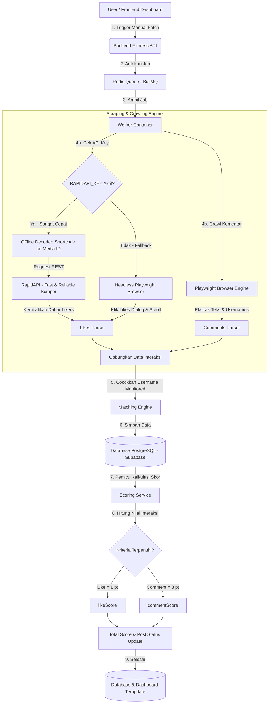

# Alur Kerja & Arsitektur Sistem Sosmed Monitoring

Dokumen ini menjelaskan alur lengkap (flow) data, fungsi, arsitektur teknis, serta detail spesifikasi sistem yang digunakan dalam proyek **Social Media Monitoring & Engagement Tracking System**.

---

## 🛠️ Spesifikasi Sistem & Teknologi Utama

Proyek ini dibangun menggunakan kombinasi teknologi modern berskala industri (*enterprise-grade*) untuk menjamin kestabilan, performa, dan kemudahan skalabilitas:

*   **Frontend Dashboard (React + Vite + Tailwind CSS + TypeScript)**:
    Menyediakan antarmuka pengguna (UI) premium yang responsif untuk memantau status secara *real-time*. Vite digunakan sebagai bundler cepat, dan Tailwind CSS untuk desain estetika tinggi.
*   **Backend API (Node.js + Express + TypeScript)**:
    REST API server yang melayani semua request dari frontend, melakukan validasi skema input dengan Zod, dan berkomunikasi dengan database serta broker antrean.
*   **Database & ORM (PostgreSQL + Prisma ORM)**:
    Penyimpanan data relasional yang andal. Menggunakan Supabase PostgreSQL di cloud untuk performa tinggi, diakses secara aman dan cepat menggunakan Prisma ORM.
*   **Queue & Job Broker (Redis + BullMQ)**:
    Sistem antrean asinkron untuk menangani scraping media sosial. BullMQ di Node.js membagi beban komputasi berat ke container worker terpisah, menggunakan Redis sebagai media penyimpanan antrean super cepat.
*   **Browser Automation & Evasion (Playwright + Playwright Stealth)**:
    Digunakan untuk merayap (*crawling*) daftar komentar postingan secara gratis. Dilengkapi dengan argumen stealth khusus untuk menyamarkan browser otomatis agar menyerupai aktivitas manusia asli.

---

## 🌐 Integrasi RapidAPI (Pengambilan Likes Aman & Cepat)

Instagram menerapkan keamanan yang sangat ketat untuk mendeteksi *headless browser* (browser tanpa UI visual) saat mencoba membuka dialog daftar penyuka (likes) postingan. Akun worker yang minim interaksi atau belum dipercaya oleh Instagram akan langsung diblokir atau disembunyikan daftar likes-nya.

Untuk mengatasi limitasi tersebut secara andal di level produksi, **sistem ini mengintegrasikan API pihak ketiga melalui portal RapidAPI**.

### 🌟 Mengapa Menggunakan RapidAPI?
1.  **Kebal Blokir Instagram**: Request ke RapidAPI ditangani oleh ribuan proxy perumahan (*residential proxies*) berkualitas tinggi dari penyedia API, sehingga Instagram tidak akan pernah memblokir server Anda.
2.  **Sangat Cepat**: Ekstraksi likes yang membutuhkan waktu hingga puluhan detik di browser kini selesai dalam milidetik via REST API HTTP Fetch biasa.
3.  **API Global Terpilih**: Proyek ini menggunakan **"Instagram API – Fast & Reliable Data Scraper"** di platform RapidAPI yang telah teruji mengembalikan 100% data likes valid.
4.  **Efisiensi Biaya (Free-Plan Ready)**: Sistem disetel dengan mode **Opsi B (Manual Fetch)**, sehingga kuota gratis 100 request/bulan dari RapidAPI Anda akan bertahan sangat lama karena request hanya dipakai saat Anda melakukan evaluasi berkala di dashboard.

---

## 🗺️ Diagram Alur (System Flowchart)



---

## 📈 Sistem Penilaian & Status (Scoring & Status Logic)

Setiap anggota (Monitored Account) yang terpantau berinteraksi pada postingan target akan diberikan nilai berdasarkan aturan berikut:

| Jenis Interaksi | Poin | Aturan Penilaian |
| :--- | :---: | :--- |
| **Like** (Menyukai Postingan) | **1** | Akun terdaftar di daftar penyuka postingan target yang ditarik dari **RapidAPI**. |
| **Comment** (Memberi Komentar) | **3** | Akun menulis komentar pada postingan target yang dirayap dari **Playwright**. |
| **Skor Maksimal** | **4** | Kombinasi Like (1) + Comment (3) = **Skor Sempurna (4)** |

### 🏷️ Status Postingan pada Dashboard:
Berdasarkan pencapaian poin di atas, sistem akan mengklasifikasikan status interaksi akun anggota menjadi:
* 🟢 **COMPLETE** (Poin 4): Akun melakukan **Like** dan **Comment** (Skor Sempurna).
* 🟡 **COMMENT_ONLY** (Poin 3): Akun **hanya memberi komentar** (Like belum dilakukan/terdeteksi).
* 🔵 **LIKE_ONLY** (Poin 1): Akun **hanya memberikan like** (Komentar belum dilakukan/terdeteksi).
* 🔴 **NONE** (Poin 0): Akun **tidak melakukan interaksi** apapun.

---

## 🔁 Penjelasan Alur Kerja Langkah-demi-Langkah

### Langkah 1: Registrasi Akun di Sistem
* **Target Account**: Akun Instagram utama yang ingin dipantau postingannya (contoh: `@yapp.rz`).
* **Monitored Account**: Akun-akun anggota/pekerja yang wajib berinteraksi (like & comment) pada postingan target tersebut (contoh: `@sukajepre.t`).

### Langkah 2: Pemicuan Proses Ekstraksi (Fetch Trigger)
Proses pencarian interaksi dapat dipicu dengan dua cara:
1. **Manual Trigger (Opsi Terpilih & Hemat Kuota)**: User mengklik tombol *Sync/Fetch* di dashboard, yang mengirimkan request POST ke API `/api/jobs/fetch-engagements`.
2. **Automatic Background (Dimatikan/0 ms)**: Scheduler berjalan otomatis berdasarkan durasi interval waktu tertentu.

### Langkah 3: Ekstrak Komentar (Comments Scraping)
* Worker meluncurkan headless browser **Playwright** yang dilengkapi modul **Stealth Evasion** (penyamaran bot agar tidak terdeteksi Instagram).
* Browser membuka link postingan target, mensimulasikan gerakan mouse alami, lalu mengekstrak semua data komentar dari halaman web.

### Langkah 4: Ekstrak Likes dengan Sistem Hybrid (Likes Scraping)
Likes memiliki tantangan ekstra karena Instagram membatasi dialog likes pada browser headless. Oleh karena itu, kita menerapkan **Sistem Hybrid Cerdas**:

```
                  ┌────────────────────────┐
                  │      Ekstrak Likes     │
                  └───────────┬────────────┘
                              │
                    Cek RAPIDAPI_KEY di .env
                              │
             ┌────────────────┴────────────────┐
             ▼ Ya                              ▼ Tidak (Fallback)
┌─────────────────────────┐          ┌─────────────────────────┐
│  Terjemahkan Shortcode  │          │   Headless Playwright   │
│  matematis ke Media ID  │          │   Browser simulasi klik │
│   (Lokal & microseconds)│          │   & dialog scrolling    │
└────────────┬────────────┘          └────────────┬────────────┘
             ▼                                    │
┌─────────────────────────┐                       │
│ Panggil REST API dengan │                       │
│    Active Key & ID      │                       │
└────────────┬────────────┘                       │
             ▼                                    ▼
┌──────────────────────────────────────────────────────────────┐
│                  Gabungkan data ke Parser                    │
└──────────────────────────────────────────────────────────────┘
```

* **Jalur API (Cepat & Kebal Blokir)**: Sistem mengambil shortcode post (contoh: `CsdVI7qhOf-`), menerjemahkannya secara matematis menjadi ID numerik database Instagram (`3106732290752178174`), lalu melakukan hit REST API super cepat ke server RapidAPI.
* **Jalur Playwright (Cadangan)**: Jika API Key tidak dikonfigurasi, sistem otomatis beralih ke simulasi browser (klik tombol jumlah like dan scroll modal box likes).

### Langkah 5: Pencocokan Akun & Penyimpanan Database
Sistem membandingkan semua daftar penilai (likes & comments) yang berhasil diekstrak dengan daftar **Monitored Account** yang aktif di sistem kita. 
* Data interaksi yang cocok disimpan ke tabel `Engagement`.
* Waktu pengambilan data dicatat pada kolom `engagementFetchedAt`.

### Langkah 6: Perhitungan Skor Akhir & Pembaruan Dashboard
* `scoringService` mendeteksi data interaksi baru, menghitung bobot nilai (Like = 1, Comment = 3), memperbarui status pencapaian (`COMPLETE`, `COMMENT_ONLY`, dll.), dan menyimpannya ke tabel `PostStatus`.
* Dashboard frontend langsung menampilkan status interaksi terbaru beserta indikator warna status masing-masing anggota.
