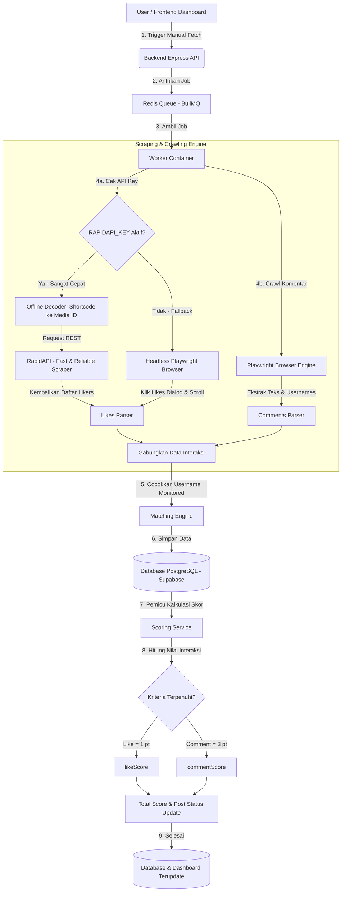

# Alur Kerja & Arsitektur Sistem Sosmed Monitoring

Dokumen ini menjelaskan alur lengkap (flow) data, fungsi, arsitektur teknis, serta detail spesifikasi sistem yang digunakan dalam proyek **Social Media Monitoring & Engagement Tracking System**.

---

## 🛠️ Spesifikasi Sistem & Teknologi Utama

Proyek ini dibangun menggunakan kombinasi teknologi modern berskala industri (*enterprise-grade*) untuk menjamin kestabilan, performa, dan kemudahan skalabilitas:

*   **Frontend Dashboard (React + Vite + Tailwind CSS + TypeScript)**:
    Menyediakan antarmuka pengguna (UI) premium yang responsif untuk memantau status secara *real-time*. Vite digunakan sebagai bundler cepat, dan Tailwind CSS untuk desain estetika tinggi.
*   **Backend API (Node.js + Express + TypeScript)**:
    REST API server yang melayani semua request dari frontend, melakukan validasi skema input dengan Zod, dan berkomunikasi dengan database serta broker antrean.
*   **Database & ORM (PostgreSQL + Prisma ORM)**:
    Penyimpanan data relasional yang andal. Menggunakan Supabase PostgreSQL di cloud untuk performa tinggi, diakses secara aman dan cepat menggunakan Prisma ORM.
*   **Queue & Job Broker (Redis + BullMQ)**:
    Sistem antrean asinkron untuk menangani scraping media sosial. BullMQ di Node.js membagi beban komputasi berat ke container worker terpisah, menggunakan Redis sebagai media penyimpanan antrean super cepat.
*   **Browser Automation & Evasion (Playwright + Playwright Stealth)**:
    Digunakan untuk merayap (*crawling*) daftar komentar postingan secara gratis. Dilengkapi dengan argumen stealth khusus untuk menyamarkan browser otomatis agar menyerupai aktivitas manusia asli.

---

## 🌐 Integrasi RapidAPI (Pengambilan Likes Aman & Cepat)

Instagram menerapkan keamanan yang sangat ketat untuk mendeteksi *headless browser* (browser tanpa UI visual) saat mencoba membuka dialog daftar penyuka (likes) postingan. Akun worker yang minim interaksi atau belum dipercaya oleh Instagram akan langsung diblokir atau disembunyikan daftar likes-nya.

Untuk mengatasi limitasi tersebut secara andal di level produksi, **sistem ini mengintegrasikan API pihak ketiga melalui portal RapidAPI**.

### 🌟 Mengapa Menggunakan RapidAPI?
1.  **Kebal Blokir Instagram**: Request ke RapidAPI ditangani oleh ribuan proxy perumahan (*residential proxies*) berkualitas tinggi dari penyedia API, sehingga Instagram tidak akan pernah memblokir server Anda.
2.  **Sangat Cepat**: Ekstraksi likes yang membutuhkan waktu hingga puluhan detik di browser kini selesai dalam milidetik via REST API HTTP Fetch biasa.
3.  **API Global Terpilih**: Proyek ini menggunakan **"Instagram API – Fast & Reliable Data Scraper"** di platform RapidAPI yang telah teruji mengembalikan 100% data likes valid.
4.  **Efisiensi Biaya (Free-Plan Ready)**: Sistem disetel dengan mode **Opsi B (Manual Fetch)**, sehingga kuota gratis 100 request/bulan dari RapidAPI Anda akan bertahan sangat lama karena request hanya dipakai saat Anda melakukan evaluasi berkala di dashboard.

---

## 🗺️ Diagram Alur (System Flowchart)



---

## 📈 Sistem Penilaian & Status (Scoring & Status Logic)

Setiap anggota (Monitored Account) yang terpantau berinteraksi pada postingan target akan diberikan nilai berdasarkan aturan berikut:

| Jenis Interaksi | Poin | Aturan Penilaian |
| :--- | :---: | :--- |
| **Like** (Menyukai Postingan) | **1** | Akun terdaftar di daftar penyuka postingan target yang ditarik dari **RapidAPI**. |
| **Comment** (Memberi Komentar) | **3** | Akun menulis komentar pada postingan target yang dirayap dari **Playwright**. |
| **Skor Maksimal** | **4** | Kombinasi Like (1) + Comment (3) = **Skor Sempurna (4)** |

### 🏷️ Status Postingan pada Dashboard:
Berdasarkan pencapaian poin di atas, sistem akan mengklasifikasikan status interaksi akun anggota menjadi:
* 🟢 **COMPLETE** (Poin 4): Akun melakukan **Like** dan **Comment** (Skor Sempurna).
* 🟡 **COMMENT_ONLY** (Poin 3): Akun **hanya memberi komentar** (Like belum dilakukan/terdeteksi).
* 🔵 **LIKE_ONLY** (Poin 1): Akun **hanya memberikan like** (Komentar belum dilakukan/terdeteksi).
* 🔴 **NONE** (Poin 0): Akun **tidak melakukan interaksi** apapun.

---

## 🔁 Penjelasan Alur Kerja Langkah-demi-Langkah

### Langkah 1: Registrasi Akun di Sistem
* **Target Account**: Akun Instagram utama yang ingin dipantau postingannya (contoh: `@yapp.rz`).
* **Monitored Account**: Akun-akun anggota/pekerja yang wajib berinteraksi (like & comment) pada postingan target tersebut (contoh: `@sukajepre.t`).

### Langkah 2: Pemicuan Proses Ekstraksi (Fetch Trigger)
Proses pencarian interaksi dapat dipicu dengan dua cara:
1. **Manual Trigger (Opsi Terpilih & Hemat Kuota)**: User mengklik tombol *Sync/Fetch* di dashboard, yang mengirimkan request POST ke API `/api/jobs/fetch-engagements`.
2. **Automatic Background (Dimatikan/0 ms)**: Scheduler berjalan otomatis berdasarkan durasi interval waktu tertentu.

### Langkah 3: Ekstrak Komentar (Comments Scraping)
* Worker meluncurkan headless browser **Playwright** yang dilengkapi modul **Stealth Evasion** (penyamaran bot agar tidak terdeteksi Instagram).
* Browser membuka link postingan target, mensimulasikan gerakan mouse alami, lalu mengekstrak semua data komentar dari halaman web.

### Langkah 4: Ekstrak Likes dengan Sistem Hybrid (Likes Scraping)
Likes memiliki tantangan ekstra karena Instagram membatasi dialog likes pada browser headless. Oleh karena itu, kita menerapkan **Sistem Hybrid Cerdas**:

```
                  ┌────────────────────────┐
                  │      Ekstrak Likes     │
                  └───────────┬────────────┘
                              │
                    Cek RAPIDAPI_KEY di .env
                              │
             ┌────────────────┴────────────────┐
             ▼ Ya                              ▼ Tidak (Fallback)
┌─────────────────────────┐          ┌─────────────────────────┐
│  Terjemahkan Shortcode  │          │   Headless Playwright   │
│  matematis ke Media ID  │          │   Browser simulasi klik │
│   (Lokal & microseconds)│          │   & dialog scrolling    │
└────────────┬────────────┘          └────────────┬────────────┘
             ▼                                    │
┌─────────────────────────┐                       │
│ Panggil REST API dengan │                       │
│    Active Key & ID      │                       │
└────────────┬────────────┘                       │
             ▼                                    ▼
┌──────────────────────────────────────────────────────────────┐
│                  Gabungkan data ke Parser                    │
└──────────────────────────────────────────────────────────────┘
```

* **Jalur API (Cepat & Kebal Blokir)**: Sistem mengambil shortcode post (contoh: `CsdVI7qhOf-`), menerjemahkannya secara matematis menjadi ID numerik database Instagram (`3106732290752178174`), lalu melakukan hit REST API super cepat ke server RapidAPI.
* **Jalur Playwright (Cadangan)**: Jika API Key tidak dikonfigurasi, sistem otomatis beralih ke simulasi browser (klik tombol jumlah like dan scroll modal box likes).

### Langkah 5: Pencocokan Akun & Penyimpanan Database
Sistem membandingkan semua daftar penilai (likes & comments) yang berhasil diekstrak dengan daftar **Monitored Account** yang aktif di sistem kita. 
* Data interaksi yang cocok disimpan ke tabel `Engagement`.
* Waktu pengambilan data dicatat pada kolom `engagementFetchedAt`.

### Langkah 6: Perhitungan Skor Akhir & Pembaruan Dashboard
* `scoringService` mendeteksi data interaksi baru, menghitung bobot nilai (Like = 1, Comment = 3), memperbarui status pencapaian (`COMPLETE`, `COMMENT_ONLY`, dll.), dan menyimpannya ke tabel `PostStatus`.
* Dashboard frontend langsung menampilkan status interaksi terbaru beserta indikator warna status masing-masing anggota.

---

## 🔄 Rencana Masa Depan: Optimalisasi & Skalabilitas Sistem Scraping

Untuk mendukung pemantauan berskala besar secara gratis selamanya dengan tingkat stabilitas 100%, kami telah merancang rencana arsitektur tingkat tinggi berbasis ide orisinal Anda:

### 1. Rotasi API Key Otomatis (RapidAPI)
*   **Konsep**: Mendaftarkan banyak API Key gratisan di `.env` yang dipisahkan dengan koma:
    ```env
    RAPIDAPI_KEY=key_akun_1,key_akun_2,key_akun_3,key_akun_4
    ```
*   **Mekanisme**: Scraper memproses array kunci secara berurutan (*Sequential Fallback*). Jika kunci saat ini mengembalikan status `403` atau `429` (kehabisan kuota 100 request), scraper langsung beralih menggunakan kunci berikutnya di detik yang sama tanpa memotong proses crawling.

### 2. Rantai Cadangan 3-Tingkat (RapidAPI + Apify + Playwright Failover)
*   **Konsep**: Menggabungkan dua penyedia API scraping berbayar (RapidAPI dan Apify) secara bergantian berbasis prioritas, dengan browser lokal sebagai pertahanan terakhir.
*   **Alur Kerja**:
    ```text
    [Mulai Crawling Likes]
              │
    Coba Jalur 1: RapidAPI (Dihitung per Request - Prioritas Utama)
              │
      ┌───────┴───────┐
    Sukses          Gagal / Habis Kuota
      │               │
      ▼               ▼
    Selesai         Coba Jalur 2: Apify Scraper (Dihitung per Liker - Cadangan)
                      │
              ┌───────┴───────┐
            Sukses          Gagal / Habis Kredit
              │               │
              ▼               ▼
            Selesai         Jalur 3: Playwright Local (Gratis - Pertahanan Terakhir)
    ```
*   **Keuntungan**:
    *   **Uptime Terjamin**: Menghindari kegagalan jika salah satu penyedia API mengalami *downtime*.
    *   **Nol Biaya (Zero Cost)**: Menguras kuota gratis bulanan RapidAPI dahulu, kemudian kuota kredit gratis $5.00 Apify, dan barulah menggunakan Playwright lokal. Semua berjalan otomatis secara gratis!

### 3. Dashboard Monitor Kredit & Pemakaian API (API Credit Monitor Widget)
*   **Konsep**: Menampilkan sisa kuota dan status pemakaian API dari RapidAPI dan Apify secara visual langsung di Dashboard Utama Admin (Overview) tanpa perlu login ke konsol eksternal.
*   **Dukungan Skala Banyak Akun (Multi-Account / Key Pooling)**:
    Jika admin mendaftarkan banyak akun gratisan di `.env` untuk melakukan rotasi, sistem akan mengelola dan menggabungkan datanya secara cerdas menggunakan tabel database relasional **`ApiKeyStatus`**:
    *   **RapidAPI (Multi-Key Caching)**:
        Setiap kali scraper selesai berjalan menggunakan salah satu kunci dari array, backend menangkap header respon `X-RateLimit-Requests-Remaining` kunci tersebut, lalu memperbarui sisa kuota khusus untuk baris kunci tersebut di database. Di Dashboard utama, sisa kuota akan dijumlahkan (*SUM*) dari semua kunci aktif (misal: `Total: 242 / 400 Requests` dari 4 akun aktif).
    *   **Apify (Multi-Token Query)**:
        Backend melakukan query berkala (secara background loop) ke REST API resmi Apify untuk setiap token akun yang terdaftar, mengambil sisa saldo kredit gratis dari masing-masing akun, dan menggabungkannya sebagai total saldo gabungan (misal: `$11.20 / $15.00` dari 3 akun Apify aktif).
*   **Keuntungan**: Admin memiliki transparansi penuh terhadap status kesehatan dan masa aktif kuota dari puluhan akun gratisan secara terpusat langsung dari layar lokal, mempermudah manajemen kapasitas tanpa pusing memantau konsol eksternal.

### 4. Integrasi Auto-Alerts & Telegram/WhatsApp Bot (Automated Notification System)
*   **Konsep**: Membangun sistem notifikasi otomatis di luar platform web (*out-of-app notification*) untuk mempercepat rantai komando, sehingga pengawasan berjalan dinamis tanpa mengharuskan admin atau anggota terus-menerus membuka layar dashboard.
*   **Arsitektur & Alur Kerja**:
    ```text
    [Post Baru Terdeteksi] ──► [Kirim Broadcaster ke Grup Koordinasi]
                                       │
                         [Tunggu Selama Waktu Toleransi (e.g., 2 Jam)]
                                       │
                                       ▼
                         [Scraper Melakukan Uji Partisipasi]
                                       │
                       ┌───────────────┴───────────────┐
                       ▼                               ▼
               [Anggota Sudah Like/Comment]    [Ada Anggota Belum Merespons]
                       │                               │
                       ▼                               ▼
                 [Abaikan Data]                [Kirim Tag/Mention Peringatan]
                                               "Halo @AnggotaX, Anda belum
                                                merespons post terbaru!"
    ```
*   **Mekanisme Teknis**:
    *   **Telegram Bot Integration**: Memanfaatkan Node.js SDK (`telegraf`) untuk membuat bot interaktif. Akun monitored akan mendaftarkan ID Telegram mereka ke sistem. Setiap kali scraping periodik selesai, worker mengidentifikasi data `MISSING` atau parsial, lalu mengirimkan pesan tag otomatis ke grup koordinasi.
    *   **WhatsApp Notification API**: Layanan alternatif menggunakan *gateway* WhatsApp pihak ketiga untuk mengirimkan chat pengingat langsung (*direct message*) kepada nomor telepon anggota yang melanggar.
    *   **Emergency Quota Warning**: Mengirimkan alert prioritas tinggi kepada admin jika gabungan sisa kredit dari *Key Pool* berstatus kritis (misal: di bawah 10% dari kuota bulanan) agar admin dapat segera melakukan rotasi/pendaftaran key baru sebelum database scraper macet.
*   **Dampak / Benefit**: Mengurangi beban kerja admin pengawas hingga 95% dan mendongkrak tingkat partisipasi anggota hingga mendekati 100% dalam waktu singkat setelah postingan terbit.

### 5. Generator Ekspor Laporan PDF & Excel (Instant Document Report Exporter)
*   **Konsep**: Menyediakan fungsionalitas satu-klik untuk mengekspor seluruh status kepatuhan dari basis data ke dalam dokumen fisik yang terformat secara rapi dan profesional untuk diserahkan ke jajaran pimpinan organisasi.
*   **Detail Format Dokumen**:
    *   **Laporan PDF Formal**: Menghasilkan berkas PDF siap cetak dengan tata letak kelas dunia:
        *   Kop Surat resmi organisasi dan tanda tangan digital.
        *   Ringkasan Statistik Utama (Persentase Kepatuhan Total, Rata-rata Keterlambatan Respons, Jumlah Akun Aktif).
        *   Grafik Diagram Lingkaran (*Pie Chart*) status kepatuhan anggota.
        *   Tabel Leaderboard 10 Besar Anggota Terbaik dan 5 Anggota dengan Kepatuhan Terendah untuk evaluasi pembinaan.
    *   **Lembar Kerja Excel (XLSX)**: Mengunduh dataset tabular yang berisi seluruh riwayat scraping detail:
        *   Kolom: ID Post, Username Target, Username Anggota, Waktu Post, Waktu Like, Waktu Comment, Status Akhir, dan Skor Perolehan.
        *   Mempermudah admin untuk melakukan filter, pivot table, atau analisis lanjutan menggunakan Microsoft Excel / Google Sheets.
*   **Mekanisme Teknis**:
    *   Di backend, kita akan mengimplementasikan `pdfkit` atau engine headless browser (`puppeteer`) untuk merender template HTML interaktif secara dinamis ke bentuk PDF di sisi server.
    *   Menggunakan pustaka `exceljs` untuk menyusun struktur baris, pewarnaan kolom status secara dinamis, dan rumus kalkulasi otomatis di berkas Excel sebelum dikirim ke klien.

### 6. Grafik Analitik Kepatuhan Tingkat Lanjut (PAC Compliance & Trend Dashboard)
*   **Konsep**: Memperkaya Halaman Overview Dashboard dengan visualisasi data statistik yang komprehensif, memetakan performa kepatuhan tidak hanya per individu melainkan juga per klaster wilayah/kelompok kepengurusan (Cabang PAC).
*   **Rencana Komponen Grafik**:
    *   **PAC Leaderboard Bar Chart**: Grafik batang vertikal yang membandingkan persentase kepatuhan rata-rata antar Cabang PAC (contoh: *PAC Cabang A: 99%*, *PAC Cabang B: 95%*, *PAC Cabang C: 70%*). Grafik ini mempermudah identifikasi wilayah mana saja yang kinerjanya tertinggal.
    *   **Tren Partisipasi Bulanan (Line Chart)**: Grafik garis dinamis yang memetakan aktivitas harian selama 30 hari terakhir. Ini sangat berguna untuk mendeteksi tren penurunan kepatuhan pada hari-hari libur atau masa-masa tertentu.
    *   **Engagement Weight Comparison Chart**: Menampilkan rasio perbandingan antara jumlah *Like* (bobot rendah) dan *Comment* (bobot tinggi) yang diselesaikan oleh anggota.
*   **Mekanisme Teknis**:
    *   Menggunakan pustaka `@radix-ui` yang dipadukan dengan **`recharts`** di sisi React frontend. Recharts mendukung visualisasi SVG responsif dengan transisi animasi CSS yang mulus serta tooltip hover bergaya modern (glassmorphic dark/light).

### 7. Gamifikasi Kepatuhan Anggota (Badges & Achievement System)
*   **Konsep**: Mengubah kewajiban pelaporan media sosial yang terkesan monoton menjadi tantangan yang interaktif dan kompetitif menggunakan elemen gamifikasi (*gamification*) untuk merangsang keaktifan anggota secara psikologis.
*   **Sistem Penghargaan & Lencana**:
    *   🏆 **Lencana "Perfect Week"**: Diberikan kepada anggota yang memiliki tingkat kepatuhan 100% (selalu melakukan *like* dan *comment*) pada seluruh postingan target selama 7 hari berturut-turut.
    *   ⚡ **Lencana "Flash Responder"**: Diberikan jika anggota secara konsisten memberikan interaksi dalam waktu kurang dari 15 menit setelah target mempublikasikan postingan baru.
    *   🛡️ **Lencana "Loyal Guard"**: Diberikan kepada anggota dengan masa bakti monitoring aktif terlama tanpa ada riwayat status `MISSING`.
*   **Mekanisme Teknis**:
    *   **Database (Prisma Schema)**: Menambahkan tabel `Badge` (id, name, icon, description) dan tabel relasi `UserBadge` (userId, badgeId, earnedAt) dengan relasi Many-to-Many ke tabel monitored accounts.
    *   **Scoring Logic**: Di dalam `scoringService`, backend mendeteksi selisih waktu antara `postedAt` dan `updatedAt` (waktu like/comment). Jika memenuhi syarat, sistem secara otomatis memberikan lencana dan memicu notifikasi pop-up khusus di browser anggota.
    *   **Visualisasi Profil**: Halaman profil monitored account akan memiliki galeri khusus yang menampilkan lencana yang berhasil mereka raih dengan pendaran neon biru-es/ungu yang bersinar.

---

## 🔌 Arsitektur Ramping Multi-Platform (Instagram, Facebook, TikTok)

Untuk mendukung pemantauan tiga platform sosial media sekaligus tanpa membebani server (VPS RAM/CPU terbatas) dan database Supabase PostgreSQL, kami merancang optimasi infrastruktur sebagai berikut:

### 1. Optimalisasi RAM Server: Pemblokiran Aset Playwright (Request Blocking)
*   **Strategi**: Menjalankan browser Chromium di server sangat memakan memori. Untuk mengatasinya, worker Playwright (baik di Node.js maupun Python) dikonfigurasi untuk memblokir pemuatan visual yang tidak diperlukan.
*   **Detail**: Bot mengabaikan pengunduhan file Gambar, Video, Fonts, dan CSS Stylesheet. Browser hanya mengunduh data mentah HTML dan menyadap respons API JSON internal.
*   **Keuntungan**: Menekan beban RAM server hingga **70%** dan meminimalkan konsumsi kuota bandwidth internet VPS hingga **80%**.

### 2. Optimalisasi Storage Database: Pemrosesan di Memori RAM (In-Memory Processing)
*   **Strategi**: Menghindari penyimpanan ratusan ribu data username publik (Likers/Commenters) ke database Supabase PostgreSQL.
*   **Detail**: Pencocokan 11 akun monitored dengan data likes/comments dilakukan langsung di memori RAM server saat scraping berlangsung. Database hanya mencatat status akhir per anggota (e.g. `COMPLETE`, `LIKE_ONLY`, dll.).
*   **Keuntungan**: Menghemat ruang penyimpanan database Supabase hingga **95%** (hanya menyimpan status terfilter, bukan jutaan baris data publik).

### 3. Skema Data Terpadu (Unified Schema dengan Enum Platform)
*   **Strategi**: Menghindari pembuatan tabel-tabel terpisah untuk setiap platform sosial media yang akan memperumit penulisan query dan dashboard.
*   **Detail**: Menggunakan satu tabel postingan generik (`SocialPost`) yang dilengkapi kolom penunjuk platform (`platform` tipe ENUM: `INSTAGRAM`, `FACEBOOK`, `TIKTOK`).
*   **Keuntungan**: Frontend dashboard dapat menggunakan satu endpoint API yang seragam dengan sistem tab filter platform.

### 4. Penjadwalan Antrean Bergantian (Sequential Queue Scheduling)
*   **Strategi**: Mencegah lonjakan CPU (*CPU spike*) hingga 100% yang berisiko membuat server hang akibat menjalankan beberapa browser secara bersamaan.
*   **Detail**: Menjadwalkan antrean scraping di BullMQ secara berurutan dengan jeda waktu tertentu (misal: Scraper IG menit 0, Scraper FB menit 10, Scraper TikTok menit 20).
*   **Keuntungan**: Menjaga utilisasi CPU server tetap stabil di bawah 20%.

---

## 🧪 Integrasi Detail & Blueprint Python FastAPI Scraping Worker

Sebagai bagian dari rencana masa depan, penambahan **Python Worker berbasis FastAPI** dirancang untuk bertindak sebagai *Microservice Stateless* khusus penarik data platform non-Instagram (TikTok & Facebook). Ini memastikan beban pemrosesan browser dipisahkan sepenuhnya tanpa mengorbankan stabilitas Node.js Express.

Untuk mempermudah manajemen, pemeliharaan, dan pemetaan, setiap modul scraper dipisahkan secara eksklusif dengan penamaan yang sangat jelas:
- **Instagram Scraper**: Dinamakan `scrapingig` (Saat ini berjalan di Node.js Express/TS: `InstagramScraper.ts`, jika di-porting ke Python akan menjadi `scrapingig.py`).
- **TikTok Scraper**: Dinamakan `scrapingtiktok` (Berjalan di Python: `scrapingtiktok.py`, Class: `ScrapingTikTok`).
- **Facebook Scraper**: Dinamakan `scrapingfacebook` (Berjalan di Python: `scrapingfacebook.py`, Class: `ScrapingFacebook`).

---

### 1. Struktur Folder Proyek Python Worker (`/scraper-service`)

Struktur folder dirancang terpisah dengan pemisahan file scraping yang jelas untuk masing-masing platform:
```text
scraper-service/
├── app/
│   ├── __init__.py
│   ├── main.py              # Entrypoint FastAPI & Routing (Mapping Request ke Scraper)
│   ├── scrapingtiktok.py    # Modul khusus TikTok Scraper (Class: ScrapingTikTok)
│   ├── scrapingfacebook.py  # Modul khusus Facebook Scraper (Class: ScrapingFacebook)
│   └── scrapingig.py        # Modul khusus Instagram Scraper jika dimigrasi (Class: ScrapingIG)
├── session/
│   ├── tiktok_session.json  # Reusable session cookies TikTok
│   └── facebook_session.json# Reusable session cookies Facebook
├── requirements.txt         # Daftar dependensi Python
├── Dockerfile               # Konfigurasi containerization
└── README.md                # Cara menjalankan locally
```

---

### 2. Spesifikasi Dependensi (`requirements.txt`)
Menggunakan pustaka asinkron berkinerja tinggi untuk memastikan pemrosesan request berjalan secepat Node.js:
*   `fastapi==0.110.0` : Web framework asinkron ASGI.
*   `uvicorn[standard]==0.28.0` : Server ASGI berperforma tinggi untuk menjalankan FastAPI.
*   `playwright==1.42.0` : Pustaka automasi browser Chromium.
*   `playwright-stealth==1.0.6` : Pustaka khusus untuk menyuntikkan bypass anti-bot sidik jari browser.
*   `pydantic==2.6.4` : Validasi skema input/output data request.

---

### 3. Skema Komunikasi API (Request-Response JSON Spec)

Node.js Express dan Python FastAPI berkomunikasi secara eksklusif menggunakan protokol HTTP JSON.

#### **A. Endpoint TikTok Scraping (`POST /scrape/tiktok`)**
- **Request Payload** (dikirim oleh Node.js):
  ```json
  {
    "post_url": "https://www.tiktok.com/@username/video/73129083109",
    "monitored_usernames": ["user_wajib1", "user_wajib2", "user_wajib3"]
  }
  ```
- **Response Payload** (dikembalikan oleh Python):
  ```json
  {
    "status": "success",
    "platform": "tiktok",
    "post_url": "https://www.tiktok.com/@username/video/73129083109",
    "likes": ["user_wajib1"],
    "comments": [
      {
        "username": "user_wajib3",
        "comment_text": "Sangat setuju dengan program kerja ini!"
      }
    ],
    "warnings": []
  }
  ```

#### **B. Endpoint Facebook Scraping (`POST /scrape/facebook`)**
- **Request Payload**:
  ```json
  {
    "post_url": "https://www.facebook.com/username/posts/123456789",
    "monitored_usernames": ["user_wajib1", "user_wajib2"]
  }
  ```
- **Response Payload**:
  ```json
  {
    "status": "success",
    "platform": "facebook",
    "post_url": "https://www.facebook.com/username/posts/123456789",
    "likes": ["user_wajib1", "user_wajib2"],
    "comments": [],
    "warnings": []
  }
  ```

---

### 4. Entrypoint Routing FastAPI (`app/main.py`)

Berikut adalah bagaimana FastAPI bertindak sebagai router yang mengarahkan tugas ke modul scraping masing-masing secara terpisah:

```python
from fastapi import FastAPI, HTTPException
from pydantic import BaseModel
from typing import List
from app.scrapingtiktok import ScrapingTikTok
from app.scrapingfacebook import ScrapingFacebook

app = FastAPI(title="Social Media Scraper Microservice")

class ScrapeRequest(BaseModel):
    post_url: str
    monitored_usernames: List[str]

@app.post("/scrape/tiktok")
async def scrape_tiktok(payload: ScrapeRequest):
    scraper = ScrapingTikTok()
    result = await scraper.scrape_engagement(payload.post_url, payload.monitored_usernames)
    if "auth_expired" in result.get("warnings", []):
        return {"status": "auth_expired", "warnings": result["warnings"]}
    return {
        "status": "success",
        "platform": "tiktok",
        "post_url": payload.post_url,
        "likes": result["likes"],
        "comments": result["comments"],
        "warnings": result["warnings"]
    }

@app.post("/scrape/facebook")
async def scrape_facebook(payload: ScrapeRequest):
    scraper = ScrapingFacebook()
    result = await scraper.scrape_engagement(payload.post_url, payload.monitored_usernames)
    return {
        "status": "success",
        "platform": "facebook",
        "post_url": payload.post_url,
        "likes": result["likes"],
        "comments": result["comments"],
        "warnings": result["warnings"]
    }
```

---

### 5. Blueprint Kode Python Worker TikTok (`app/scrapingtiktok.py`)

Berikut adalah cetak biru kode asinkron Python yang memanfaatkan Playwright untuk melakukan ekstraksi interaksi TikTok secara ringan dan terisolasi:

```python
import asyncio
from playwright.async_api import async_playwright
from playwright_stealth import stealth_async

class ScrapingTikTok:
    def __init__(self, session_path: str = "session/tiktok_session.json"):
        self.session_path = session_path

    async def scrape_engagement(self, post_url: str, monitored_users: list) -> dict:
        likes_found = []
        comments_found = []
        warnings = []
        
        async with async_playwright() as p:
            # 1. Launch browser dengan arguments anti-bot detection
            browser = await p.chromium.launch(
                headless=True,
                args=[
                    "--disable-blink-features=AutomationControlled",
                    "--no-sandbox",
                    "--disable-setuid-sandbox"
                ]
            )
            
            # 2. Buat context dengan persistent storage state (jika ada cookie)
            context = await browser.new_context(
                user_agent="Mozilla/5.0 (Windows NT 10.0; Win64; x64) AppleWebKit/537.36 (KHTML, like Gecko) Chrome/122.0.0.0 Safari/537.36",
                viewport={"width": 1280, "height": 800}
            )
            
            # 3. Suntikkan script Stealth Bypass Sidik Jari Browser
            page = await context.new_page()
            await stealth_async(page)
            
            # 4. Optimasi RAM: Blokir pemuatan gambar, stylesheet, dan media
            await page.route("**/*", lambda route: 
                route.abort() if route.request.resource_type in ["image", "stylesheet", "font", "media"]
                else route.continue_()
            )
            
            try:
                # 5. Navigasi ke URL Video TikTok dengan toleransi timeout 45 detik
                await page.goto(post_url, wait_until="domcontentloaded", timeout=45000)
                await page.wait_for_timeout(4000) # Jeda peniruan manusia
                
                # 6. Scraping Comments (Membaca elemen komentar ter-render)
                comment_elements = await page.query_selector_all('p[data-e2e="comment-level-1"]')
                
                for el in comment_elements:
                    text = await el.inner_text()
                    parent = await el.evaluate_handle("el => el.closest('div')")
                    user_el = await parent.query_selector('a[href*="/@"]')
                    
                    if user_el:
                        href = await user_el.get_attribute("href")
                        username = href.split("@")[-1].replace("/", "").strip().lower()
                        
                        if username in monitored_users:
                            comments_found.append({
                                "username": username,
                                "comment_text": text.strip()
                            })
                            
                # 7. Scraping Likes (Menggunakan cookies dari session_path)
                # ...
                
            except Exception as e:
                warnings.append(f"Scraping error: {str(e)}")
            finally:
                await page.close()
                await context.close()
                await browser.close()
                
        return {
            "likes": likes_found,
            "comments": comments_found,
            "warnings": warnings
        }
```

---

### 6. Blueprint Kode Python Worker Facebook (`app/scrapingfacebook.py`)

Berikut adalah cetak biru kode asinkron Python yang memanfaatkan Playwright untuk melakukan ekstraksi interaksi Facebook secara terisolasi:

```python
import asyncio
from playwright.async_api import async_playwright
from playwright_stealth import stealth_async

class ScrapingFacebook:
    def __init__(self, session_path: str = "session/facebook_session.json"):
        self.session_path = session_path

    async def scrape_engagement(self, post_url: str, monitored_users: list) -> dict:
        likes_found = []
        comments_found = []
        warnings = []
        
        async with async_playwright() as p:
            browser = await p.chromium.launch(
                headless=True,
                args=["--disable-blink-features=AutomationControlled", "--no-sandbox"]
            )
            context = await browser.new_context(
                user_agent="Mozilla/5.0 (Windows NT 10.0; Win64; x64) AppleWebKit/537.36",
                viewport={"width": 1280, "height": 800}
            )
            page = await context.new_page()
            await stealth_async(page)
            
            # Optimasi RAM
            await page.route("**/*", lambda route: 
                route.abort() if route.request.resource_type in ["image", "stylesheet", "font", "media"]
                else route.continue_()
            )
            
            try:
                # Navigasi ke postingan Facebook
                await page.goto(post_url, wait_until="domcontentloaded", timeout=45000)
                await page.wait_for_timeout(3000)
                
                # Logika ekstraksi interaksi Facebook (likes & comments)
                # ...
                
            except Exception as e:
                warnings.append(f"Scraping error: {str(e)}")
            finally:
                await page.close()
                await context.close()
                await browser.close()
                
        return {
            "likes": likes_found,
            "comments": comments_found,
            "warnings": warnings
        }
```

---

### 7. Penanganan Error & Resiliensi Sistem (Failover & Error Handling)

*   **Pencegahan Token Expired**: Jika bot mendeteksi dialihkan ke halaman login TikTok (`/login`) atau Facebook login, bot Python langsung mengembalikan status error `{ "status": "auth_expired" }` ke Node.js. Node.js akan menangkap kode ini, menangguhkan scraping platform terkait sementara, dan memicu notifikasi peringatan di dashboard agar admin melakukan pembaruan sesi cookie.
*   **Rate Limit Detection**: Jika terdeteksi tantangan CAPTCHA atau blokir jaringan (`429 Too Many Requests`), bot akan mengembalikan status `{ "status": "rate_limited" }`. Worker Node.js secara otomatis akan memindahkan tugas platform tersebut kembali ke antrean Redis dengan waktu tunda eksponensial (*Exponential Backoff Delay*) selama 30 menit.
*   **Stateless Isolation**: Karena bot Python sama sekali tidak terhubung ke PostgreSQL Supabase, tidak ada risiko kebocoran koneksi database pooler. Jika bot Python mengalami kegagalan/crash, server web utama Node.js Express akan tetap berjalan normal dan hanya mencatat log error pada dashboard.

---

### 8. Cara Deploy di Server (Docker Compose Integration)

Dalam lingkungan Docker, kita cukup menyandingkan container Python ini sebagai service baru di dalam `docker-compose.yml` utama:

```yaml
version: '3.8'

services:
  # Service Node.js Backend utama tetap sama
  backend:
    build: ./backend
    ports:
      - "4000:4000"
    environment:
      - TIKTOK_SCRAPER_URL=http://tiktok-scraper:8000
    depends_on:
      - redis
      - tiktok-scraper

  # Service Baru: Python FastAPI Scraper Worker
  tiktok-scraper:
    build: ./scraper-service
    ports:
      - "8000:8000"
    volumes:
      - ./scraper-service/session:/app/session
    environment:
      - PORT=8000
    restart: always
```
Dengan arsitektur terisolasi seperti ini, ke depannya dapat melakukan *scaling* (meningkatkan spesifikasi server) hanya untuk kontainer Python scraper saja jika beban scraping TikTok meningkat, tanpa perlu mengotak-atik kontainer backend API dashboard Node.js.


